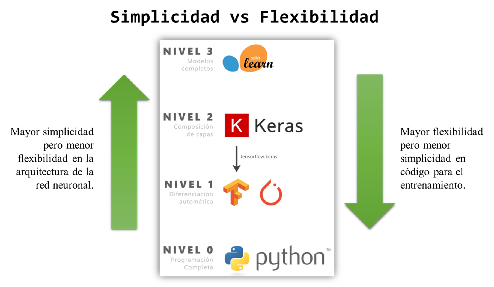

# IA_Notebooks_ML
Estos cuadernos Notebooks son los que he ido desarrollando en el proceso de aprendizaje sobre Redes Neuronales, por lo que contiene bastantes líneas comentadas, e incluso, en algunos casos he hecho pruebas y/o comprobaciones adicionales que hice para entender algunas o varias líneas de código.

## Resumen Notebooks + Info
Aquí haré un resumen de cada Notebook creado, básicamente explicar cuál es el enfoque que se le dió a cada uno.

### Regresión Lineal
_[Desarrollado en base a este vídeo.](https://youtu.be/w2RJ1D6kz-o)_

Se trabajó con el dataset "Boston" que está accesible por la librería Scikit-Learn, los datos usados fueron:

1. Número medio de habitaciones
2. Valor medio de la vivienda

Con el fin de crear un modelo que nos permita predecir o saber el precio de una vivienda teniendo en cuenta su número de habitaciones.
Esto es un ejercicio básico y se podría ahondar mucho más teniendo en cuenta otros factores, como por ejemplo:

1. Tasa media de criminalidad por ciudad
2. Concentración de oxidos nítricos
3. Proporción de centros comerciales por ciudad

Y más, cada factor que quisieramos tomar en cuenta se consideraría una dimensión más de nuestros datos, por lo que su manejo y enfoque serían diferentes, además que poco didacticos para empezar. xD

### Ataques Adversarios
_[Desarrollado en base a este vídeo.](https://youtu.be/JoQx39CoXW8)_

La idea es la siguiente: darle una imagen de entrada al modelo Inception V3 que para el ojo humano, no parezca que sea manipulada pero que cuando lo procese el modelo, nos diga que es un... limón? xD Si, un limón!!
Claro que podríamos hacer que el modelo vea otra cosa diferente a un limón pero para ello habría que ver las clases de imagen que reconoce, como se verá en el notebook, la clase 951 que es la del limón, si se quiere algo diferente, hay que probar con otros números.

### Descenso del Gradiente
_[Desarrollado en base a este vídeo.](https://youtu.be/-_A_AAxqzCg)_

El descenso del gradiente... un método iterativo para minimizar el error, si quieres entender mejor esto, te invito a ver [este vídeo](https://youtu.be/A6FiCDoz8_4), ya que lo explica bastante claro, sin embargo, para resumir, lo que se quiere es dar un paso a la vez por cada iteración para ir reduciendo el error.

### Programando una Red Neuronal desde Cero
_[Desarrollado en base a este vídeo.](https://youtu.be/W8AeOXa_FqU)_

Ahora si, por fin! A programar una red neuronal! Pero no será tan simple como suena. xD
Para empezar, no se hará uso de librerías como Tensorflow o Keras, como mucho se usará numpy para las operaciones con matrices y matplotlib para hacer las gráficas.
Por lo que el código no será versátil, es decir, que si luego queremos hacer cambios, habría que rehacer todo el programa desde cero, lo cual es totalmente ineficiente y es ahí cuando ya entran las librerías antes mencionadas, pero como esto es como una guía edcucativa, veremos de que está compuesto una red neuronal a detalle y así tener una mejor comprensión.

### Red Neuronal con TensorFlow_Keras_Scikit-Learn
_[Desarrollado en base a este vídeo.](https://youtu.be/qTNUbPkR2ao)_

Aquí ya hacemos uso de las librerías más conocidas del machine learning y/o data science, veremos como usando usando estás librerías podemos darle una solución mucho más rápida y con menos líneas de código, al problema de crear una red neuronal, pero también veremos que conforme se va subiendo de nivel en librerías, la flexibilidad de nuestro programa disminuye.

En la siguiente imagen se puede apreciar lo indicado antes pero para mayor entendimiento, puede ver el vídeo del enlace proporcionado al inicio de esta sección:

### IA Pix2Pix
_[Desarrollado en base a este vídeo.](https://youtu.be/YsrMGcgfETY)_

Por fin!! Ya está terminado el modelo de IA Pix2Pix, un modelo que hace uso de redes neuronales generativas adversarias, que para este caso específico lo usaremos para darle mejor nitidez a una imagen de poco nítida o baja calidad que representa a a alguna flor. Claro que el modelo no se limita a solo eso y es [en este video](https://youtu.be/BerOC6n8j9Q) en el que se presentan 40 diferentes proyectos usando esta tecnología, todos desarrollados por la comunidad del [canal dotCSV](https://www.youtube.com/c/DotCSV). :smiley:

Peronsalmente me fue motivador toda esa recopilación, ya que gente sin mucho conocimiento o que recién está empezando en este campo, al igual que yo, ha podido crear cosas tan interesantes, curiosas y con enfoques de problemas reales, recomendadísimo! :smile:

#### Nota adicional
Como nota adicional, comparto [aquí el enlace al Drive](https://drive.google.com/drive/folders/1eHRQJO8GQvoX73MwBTXm-xUed2iXsDla?usp=sharing) que contiene los recursos usados para este último proyecto.

## Agradecimiento especial :smiley:
Sin más que decir, agradezco tremendamente el gran contenido de calidad que ofrece el [canal dotCSV](https://www.youtube.com/c/DotCSV), gracias a ello me he podido incursionar en este mundo de la inteligencia artificial y motivarme aún más con cada nuevo vídeo! :laughing:

## Licencia
Este proyecto está bajo la [esta licencia](LICENSE) que puede leer para más información con respecto a los derechos, limitaciones y garantías.
